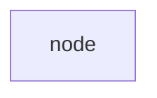

####  Используемые  либы

- nltk - для   статической обрабоки  текста ( разбиение на  предложения  и слова)
- словарь от  libreoffice

###### Лирика: сузествуют либы для поиска ошибок, к примеру 
- pyenchant - для поиска  ошибок 
- difflib - для  вычисления  различий  между словами

###### Но мы будем  использовать для  поиска в  словаре 
- алгоритм Левенштейна для сравнения 2 строк
- и алгоритм сравнения строк на основе коэффициента Жаккара
- затем  для  однознаности  -  поиск  однокоренны слов

##### Архитектура приложения 



#### Настройка  ```Ubuntu```

- 1. Создать виртуальное окружение  

  ```python3 -m venv venv
  
- 2. Активируем  окружение 

``` source venv/bin/activate```

- 3. Установить зависимости 
 
  ```pip install -r requirements.txt```
 
- 3. И запуск)

  ```python3 main.py -f sample.txt

#### Пример запуска ```Windows```

```python
python  main.py -f C:\Users\user\Documents\PROJECTS\orfo_error\sample.txt
```

**Результат работы скрипта**

```python
2022-03-20 16:58:35,246 [INFO] Поиск  ошибок ...
сонце
2022-03-20 16:58:35,519 [INFO] Исходное  предложение:           Выплыла из-за леса сонце.
2022-03-20 16:58:35,521 [INFO] Найденные ошибки: ['сонце']
2022-03-20 16:58:35,522 [INFO] Возможно имелось ввиду:           выплыла из-за леса солнце.
....
```
